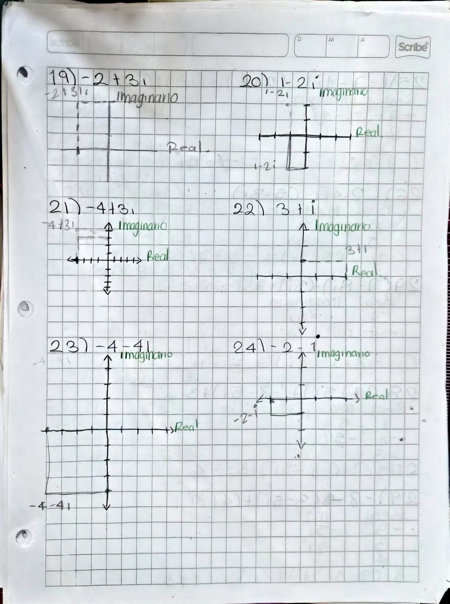
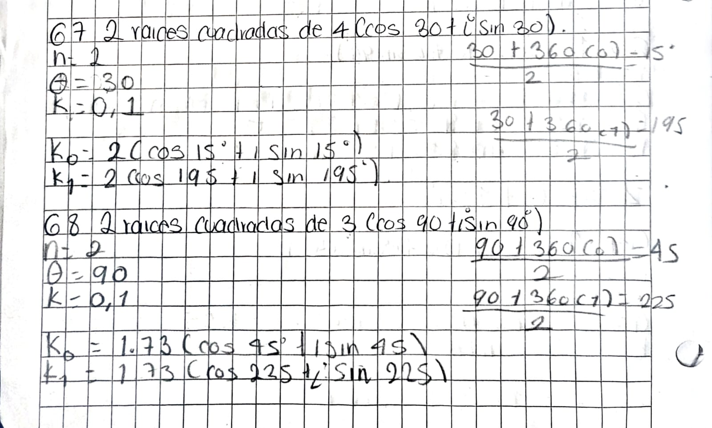
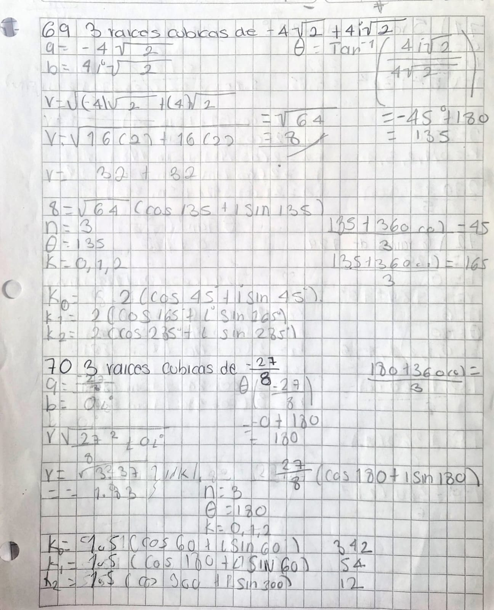
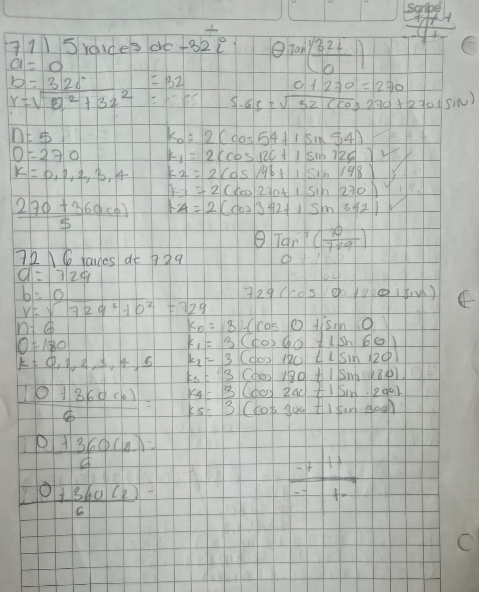

# Fundamentos de algebra Dafne Sulu 

---

## Registro de los ejercicios

---
### 19

### Ejercicio 25: $(-7 - 4i) - (2 + i)$
$$
\begin{aligned}
(-7 - 4i) - (2 + i) &= -7 - 4i - 2 - i \\
&= (-7 - 2) + (-4i - i) \\
&= -9 - 5i
\end{aligned}
$$
### Ejercicio 26: ($2 - 4i) - (5 - 3i)$
$$
\begin{aligned}
(2 - 4i) - (5 - 3i) &= 2 - 4i - 5 + 3i \\
&= (2 - 5) + (-4i + 3i) \\
&= -3 - i
\end{aligned}
$$
### Ejercicio 27: ($7 - 8i) - (- 3i)-7$
$$
\begin{aligned}
(7 - 8i) - (-3i) - 7 &= 7 - 8i + 3i - 7 \\
&= (7 - 7) + (-8i + 3i) \\
&= -5i
\end{aligned}
$$

### Ejercicio 28: $(1 + 5i) + (-8 - 5i) + 3$
$$
\begin{aligned}
(1 + 5i) + (-8 - 5i) + 3 &= 1 + 5i - 8 - 5i + 3 \\
&= (1 - 8 + 3) + (5i - 5i) \\
&= -4
\end{aligned}
$$
### Ejercicio 29: $-8(3 - 5i) + (4 + 8i)$
$$
\begin{aligned}
-8(3 - 5i) + (4 + 8i) &= -24 + 40i + 4 + 8i \\
&= (-24 + 4) + (40i + 8i) \\
&= -20 + 48i
\end{aligned}
$$
### Ejercicio 30: $(-4+2i) + (3i)(-4 - 7i)$
$$
\begin{aligned}
(-4 + 2i) + (3i)(-4 - 7i) &= -4 + 2i - 12i - 21i^2 \\
&= -4 - 10i - 21(-1) \\
&= -4 + 21 - 10i \\
&= 17 - 10i
\end{aligned}
$$

---

## 2. Multiplicación de Números Complejos
### Ejercicio 31: $(2i)(-4i)$
$$
\begin{aligned}
(2i)(-4i) &= 2 \cdot (-4) \cdot i^2 \\
&= -8(-1) \\
&= 8
\end{aligned}
$$
### Ejercicio 32: $(-2i)(5i)*6$
$$
\begin{aligned}
(-2i)(5i) \cdot 6 &= (-2 \cdot 5 \cdot 6) \cdot i^2 \\
&= -60(-1) \\
&= 60
\end{aligned}
$$
### Ejercico 33: $(-7i)(8 + 8i)(-2-8i)$
$$
\begin{aligned}
(-7i)(8 + 8i)(-2 - 8i) &= (-56i - 56i^2)(-2 - 8i) \\
&= (-56i - 56(-1))(-2 - 8i) \\
&= (56 - 56i)(-2 - 8i) \\
&= -112 - 448i + 112i + 448i^2 \\
&= -112 - 336i + 448(-1) \\
&= -560 - 336i
\end{aligned}
$$
### Ejercico 34: $(-2-4)(-1 - 6i)(7-6i)$
$$
\begin{aligned}
(-2 - 4i)(-1 - 6i)(7 - 6i) &= (2 + 12i + 4i + 24i^2)(7 - 6i) \\
&= (2 + 16i + 24(-1))(7 - 6i) \\
&= (-22 + 16i)(7 - 6i) \\
&= -154 + 132i + 112i - 96i^2 \\
&= -154 + 244i - 96(-1) \\
&= -58 + 244i
\end{aligned}
$$

### Ejercicio 35: $(3i)(1 - 7i)(7 + 4i)$
$$
\begin{aligned}
(3i)(1 - 7i)(7 + 4i) &= (3i - 21i^2)(7 + 4i) \\
&= (3i - 21(-1))(7 + 4i) \\
&= (21 + 3i)(7 + 4i) \\
&= 147 + 84i + 21i + 12i^2 \\
&= 147 + 105i + 12(-1) \\
&= 135 + 105i
\end{aligned}
$$
### Ejercicio 36: $(-6i)(-5 + i)(6 - 2i)$

$$
\begin{aligned}
(-6i)(-5 + i)(6 - 2i) &= (30i - 6i^2)(6 - 2i) \\
&= (30i - 6(-1))(6 - 2i) \\
&= (6 + 30i)(6 - 2i) \\
&= 36 - 12i + 180i - 60i^2 \\
&= 36 + 168i - 60(-1) \\
&= 96 + 168i
\end{aligned}
$$

---

## 3. División de Números Complejos

### Ejercicio 37: $\frac{10 - 7i}{1 + 3i}$

$$
\frac{10 - 7i}{1 + 3i} = -\frac{11}{10} - \frac{37}{10}i
$$

### Ejercicio 38: $\frac{4 + 2i}{-1 - 10i}$
$$
\frac{4 + 2i}{-1 - 10i} = -\frac{24}{101} - \frac{38}{101}i
$$
### Ejercicio 39: $\frac{1 + 4i}{-1 - 6i}$
$$
\frac{1 + 4i}{-1 - 6i} = -\frac{25}{37} - \frac{2}{37}i
$$
### Ejercicio 40: $\frac{-8 + 4i}{1 + i}$
$$
\frac{-8 + 4i}{-1 + i} = 2i + 6
$$
### Ejercicio 41: $\frac{-10 + 8i}{6 + i}$
$$
\frac{-10 + 8i}{6 + i} = -\frac{52}{37} + \frac{58}{37}i
$$
### Ejercicio 42: $\frac{2 - 2i}{4 - 10i}$

$$
\frac{2 - 2i}{4 - 10i} = \frac{7}{29} - \frac{3}{29}i
$$

---

## 4. Valor Absoluto (Módulo) de un Número Complejo

### Ejercicio 43: $|-9 - 9i|$
$$
|-9 - 9i| = \sqrt{(-9)^2 + (-9)^2} = \sqrt{81 + 81} = \sqrt{162} = 9\sqrt{2}
$$
### Ejercicio 44: $|8 - 6i|$
$$
|8 - 6i| = \sqrt{8^2 + (-6)^2} = \sqrt{64 + 36} = \sqrt{100} = 10
$$
### Ejercicio 45: $|6 - 3i|$
$$
|6 - 3i| = \sqrt{6^2 + (-3)^2} = \sqrt{36 + 9} = \sqrt{45} = 3\sqrt{5}
$$
### Ejercicio 46: $|10 + 10i|$
$$
|10 + 10i| = \sqrt{10^2 + 10^2} = \sqrt{100 + 100} = \sqrt{200} = 10\sqrt{2}
$$
### Ejercicio 47: $|6 - 10i|$
$$
|6 - 10i| = \sqrt{6^2 + (-10)^2} = \sqrt{36 + 100} = \sqrt{136} = 2\sqrt{34}
$$

### Ejercicio 48: $|-1 + 7i|$
$$
|-1 + 7i| = \sqrt{(-1)^2 + 7^2} = \sqrt{1 + 49} = \sqrt{50} = 5\sqrt{2}
$$

---

## 5. Potencias de la Unidad imaginarios
### Ejercicio 49: $i^{5}$
$$
i^5 = i^4 \cdot i = (1) \cdot i = i
$$
### Ejercicio 50: $i^{10}$
$$
i^{10} = (i^4)^2 \cdot i^2 = (1)^2 \cdot (-1) = -1
$$
### Ejercicio 51: $i^{20}$
$$
i^{20} = (i^4)^5 = (1)^5 = 1
$$
### Ejercicio 52: $i^{35}$
$$
i^{35} = (i^4)^8 \cdot i^3 = (1)^8 \cdot (-i) = -i
$$
### Ejercicio 53: $i^{256}$
$$
i^{256} = (i^4)^{64} = (1)^{64} = 1
$$
### Ejercicio 54: $i^{5^5}$
$$
i^{5^5} = i^{3125} = (i^4)^{781} \cdot i = (1)^{781} \cdot i = i
$$

---
## 6 Conversiones a su forma polar

### Ejercicio 55: $6 - 8i$

$$
6 - 8i = 10(\cos(-53.13^\circ) + i\sin(-53.13^\circ))
$$

### Ejercicio 56: $5\sqrt{2} + 5\sqrt{2}i$

$$
5\sqrt{2} + 5\sqrt{2}i = 10(\cos(45^\circ) + i\sin(45^\circ))
$$

### Ejercicio 57: $2 - 2\sqrt{3}i$

$$
2 - 2\sqrt{3}i = 4(\cos(-60^\circ) + i\sin(-60^\circ))
$$

### Ejercicio 58: $\frac{3\sqrt{3}}{2} - \frac{3}{2}i$

$$
\frac{3\sqrt{3}}{2} - \frac{3}{2}i = 3(\cos(-30^\circ) + i\sin(-30^\circ))
$$

### Ejercicio 59: $-2$

$$
-2 = 2(\cos(180^\circ) + i\sin(180^\circ))
$$

### Ejercicio 60: $-7i$

$$
-7i = 7(\cos(270^\circ) + i\sin(270^\circ))
$$
---

### Conversiones a forma rectangular

### Ejercicio 61: $\cos 30^\circ + i\sin 30^\circ$

$$
\cos 30^\circ + i\sin 30^\circ = \frac{\sqrt{3}}{2} + \frac{1}{2}i
$$

### Ejercicio 62: $2(\cos 60^\circ + i\sin 60^\circ)$

$$
2(\cos 60^\circ + i\sin 60^\circ) = 1 + \sqrt{3}i
$$

### Ejercicio 63: $1.5(\cos 90^\circ + i\sin 90^\circ)$

$$
1.5(\cos 90^\circ + i\sin 90^\circ) = 1.5i
$$

### Ejercicio 64: $2.5(\cos 120^\circ + i\sin 120^\circ)$

$$
2.5(\cos 120^\circ + i\sin 120^\circ) = -1.25 + \frac{5\sqrt{3}}{4}i
$$

### Ejercicio 65: $4(\cos 135^\circ + i\sin 135^\circ)$

$$
4(\cos 135^\circ + i\sin 135^\circ) = -2\sqrt{2} + 2\sqrt{2}i
$$

### Ejercicio 66: $3(\cos 180^\circ + i\sin 180^\circ)$

$$
3(\cos 180^\circ + i\sin 180^\circ) = -3
$$

 ### Raíces de números complejos
 

### Realiza las conversiones de binario a decimal
73) 00001111 = *15*
 74) 10011001 = *153*
 75) 11001100 = *204*
 76) 01111011 = *123*
 77) 00000000 11111111 = *255*
78) 00000010 00000000 = *512*

### Convierte de binario a octal
79) 11010101 = *325*
80) 01101110 = *156*
81) 10110011 = *263*
82) 00000000 11111111 = *377*
83) 00000011 11000000 = *0170*
84) 00000101 01010101 = *012525*

### Convierte de binario a hexadecimal
 85) 11011010 = *DA*
 86) 01111100 = *7C*
 87) 10110101 = *B5*
 88) 11110000 10100101 = *F0A5*
 89) 00001111 00001111 = *0F0F*
 90) 10000000 00000001 = *8001*

### Convierte de octal a binario
 91) 325 = 011010101
 92) 156 = 001101110
 93) 377 = 00000000 11111111
 94) 01777 = 000001111111111
 95) 03700 = 000011111000000
 96) 05255 = 000101010101101

### Convierte de hexadecimal a binario
97) DA = 1101 1010
 98) 7C = 0111 1100
 99) B5 = 1011 0101
 100) F0A5 = 1111 0000 1010 0101
101) 0F0F = 0000 1111 0000 1111
102) 8001 = 1000 0000 0000 0001

## Nombra los polinomios por su exponente más alto y número de términos

103. $5n + 5$
   - **Grado:** Lineal (primer grado)
   - **Número de términos:** Binomio

104. $-10p^3 - 6 + 9p^2 - 4p^5 - 2p^8$
   - **Grado:** De octavo grado
   - **Número de términos:** Polinomio (5 términos)

105. $7x^8$
   - **Grado:** De octavo grado
   - **Número de términos:** Monomio

106. $-2n + n^4 + 10n^6$
   - **Grado:** De sexto grado
   - **Número de términos:** Trinomio

107. $5$
   - **Grado:** Constante (grado cero)
   - **Número de términos:** Monomio

108. $5v^7$
   - **Grado:** De séptimo grado
   - **Número de términos:** Monomio

---

## Resuelve las siguientes preguntas

109. Amy puede verter una gran entrada de concreto en ocho horas. Un día su amiga Jill la ayudó y solo tomó 3.08 horas. Encuentra cuánto le tomaría a Jill hacerlo sola.
   - **Respuesta:** Aproximadamente **5.01 horas** (5 horas y 45 segundos)
   - **Procedimiento:**
     $$\frac{1}{8} + \frac{1}{x} = \frac{1}{3.08} \implies \frac{1}{x} = \frac{1}{3.08} - \frac{1}{8} \implies x \approx 5.0081\text{ h}$$

110. Jaidee puede cavar un hoyo de 10 pies por 10 pies en cinco horas. Ted puede cavar el mismo hoyo en siete horas. Si trabajaran juntos, ¿cuánto tiempo les tomaría?
   - **Respuesta:** **2.92 horas** (2 horas y 55 minutos)
   - **Procedimiento:**
     $$\frac{1}{5} + \frac{1}{7} = \frac{12}{35} \implies t = \frac{35}{12} \approx 2.9167\text{ h}$$

111. Un avión de carga salió de Los Ángeles y voló hacia Moscú. Un avión de la Fuerza Aérea salió cuatro horas después volando a 310 km/h en un esfuerzo por alcanzar al avión de carga. Después de volar durante seis horas, el avión de la Fuerza Aérea finalmente lo alcanzó. ¿Cuál era la velocidad promedio del avión de carga?
   - **Respuesta:** **186 km/h**
   - **Procedimiento:**
     $$\text{Distancia} = 310\text{ km/h} \times 6\text{ h} = 1860\text{ km}$$
     $$\text{Tiempo del avión de carga} = 6 + 4 = 10\text{ h}$$
     $$\text{Velocidad} = \frac{1860\text{ km}}{10\text{ h}} = 186\text{ km/h}$$

112. Un tren de carga viajó a Nueva York y de regreso. En el viaje de ida viajó a 35 km/h y en el viaje de regreso fue a 49 km/h. ¿Cuánto tiempo tomó el viaje de ida si el viaje de regreso tomó diez horas?
   - **Respuesta:** **14 horas**
   - **Procedimiento:**
     $$\text{Distancia de regreso} = 49\text{ km/h} \times 10\text{ h} = 490\text{ km}$$
     $$\text{Tiempo de ida} = \frac{490\text{ km}}{35\text{ km/h}} = 14\text{ h}$$

113. $1\text{ yd}^3$ de tierra que contenía 30% de arena se mezcló con $4\text{ yd}^3$ de tierra que contenía 20% de arena. ¿Cuál es el contenido de arena de la mezcla?
   - **Respuesta:** **22%**
   - **Procedimiento:**
     $$\frac{(1 \times 0.30) + (4 \times 0.20)}{1 + 4} = \frac{0.30 + 0.80}{5} = \frac{1.10}{5} = 0.22 \implies 22\%$$

114. Para su fiesta de cumpleaños, James mezcló 7 L de ponche de frutas de la Marca A y 6 L de la Marca B. La Marca A contiene 11% de jugo de fruta y la Marca B contiene 24% de jugo de fruta. ¿Qué porcentaje de la mezcla es jugo de fruta?
   - **Respuesta:** Aproximadamente **17%** (17.00%)
   - **Procedimiento:**
     $$\frac{(7 \times 0.11) + (6 \times 0.24)}{7 + 6} = \frac{0.77 + 1.44}{13} = \frac{2.21}{13} = 0.17 \implies 17\%$$
